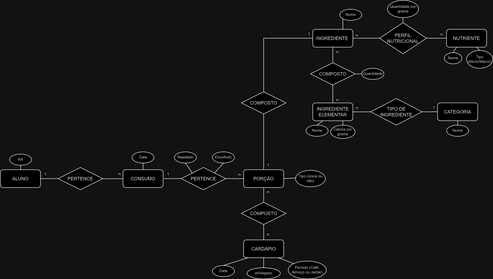

# Modelo para Apresentação do Lab03 - Modelagem Conceitual de Refeições em um Restaurante

# Equipe `<nome da equipe>`

# Subgrupo `<letra do subgrupo>`
* `<nome completo>` - `<RA>`
* `<nome completo>` - `<RA>`
* `<nome completo>` - `<RA>`

## Modelo Conceitual ER Revisado

*Diagrama ER Revisado*

## Mapeamento para o Modelo Relacional

~~~
PESSOA(_Código_, Nome, Telefone)
ARMÁRIO(_Código_, Tamanho, Ocupante)
  Ocupante chave estrangeira -> PESSOA(Código)
~~~