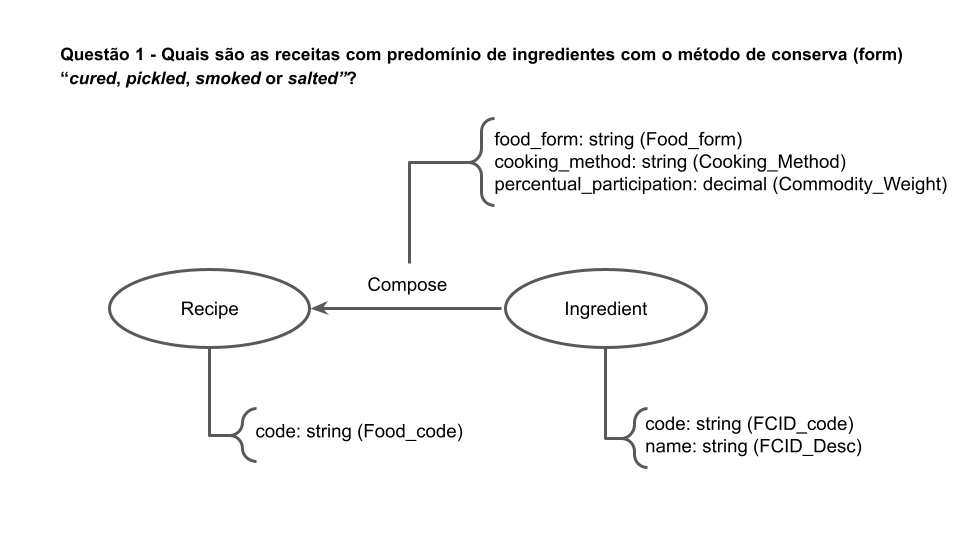
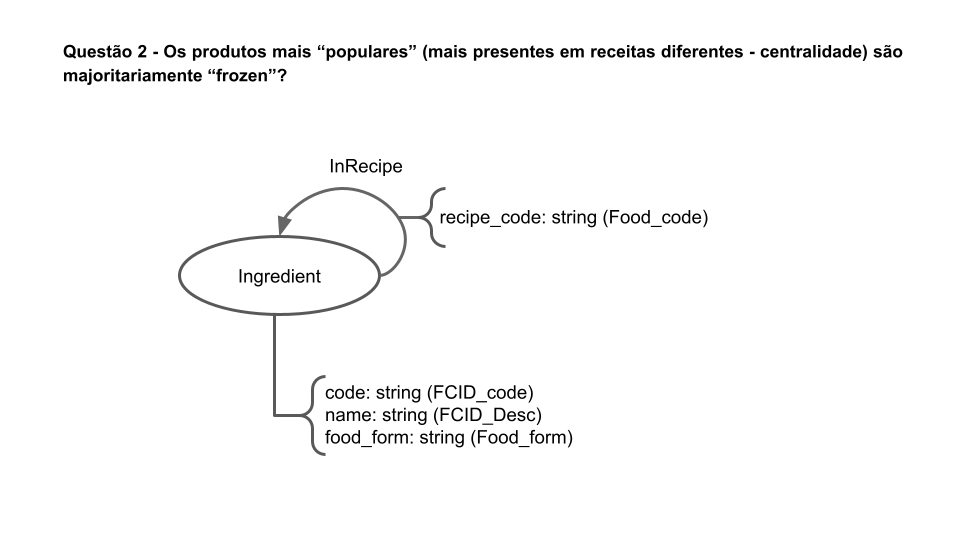
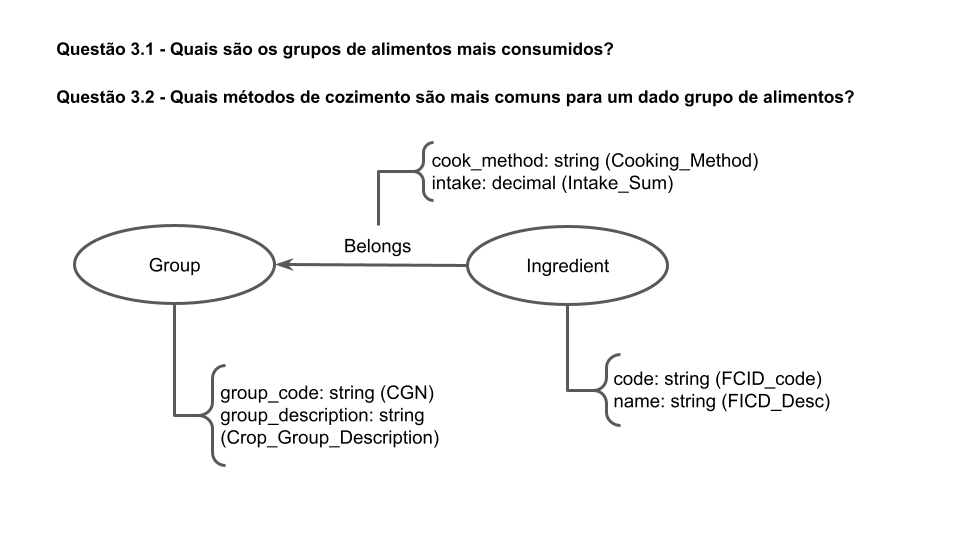

# Equipe LAMEV

# Subgrupo VLV
* Luiz Guilherme Sousa Nascimento - 230667
* Victor Wu - 231467
* Vitor Paziam Magalhães - 238316

## Modelo Lógico do Banco de Dados de Grafos

**Obs:** Apresentamos três modelos lógicos separadamente, cada um apto a responder uma pergunta específica de pesquisa ou análise.

> 

> 

> 

## Perguntas de Pesquisa/Análise

> * Quais são as receitas com predomínio de ingredientes com o método de conserva “cured, pickled, smoked or salted”?
> * Os produtos mais “populares” (mais presentes em receitas diferentes - centralidade) são majoritariamente “frozen”?
> * Quais são os grupos de alimentos mais consumidos?
> * Quais métodos de cozimento são mais comuns para um dado grupo de alimentos?