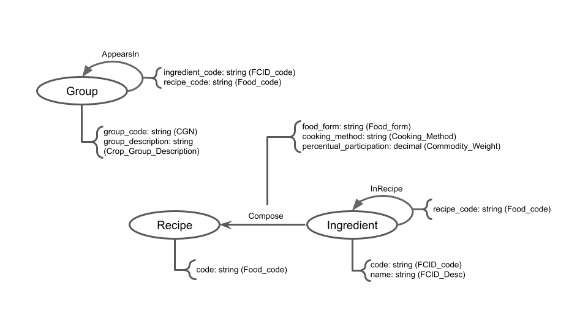

# Equipe LAMEV

# Subgrupo VLV
* Luiz Guilherme Sousa Nascimento - 230667
* Victor Wu - 231467
* Vitor Paziam Magalhães - 238316

## Modelo Lógico do Banco de Dados de Grafos

> 

## Perguntas de Pesquisa/Análise Combinadas e Respectivas Análises

### Pergunta/Análise 1
> * Quais são as receitas com predomínio de ingredientes com o método de conserva (form) *“cured, pickled, smoked or salted”*?
>   
>   * No modelo proposto, os nós *Ingrediente* e *Receita* se conectam com arestas que representam a presença do ingrediente em uma receita. Embora uma receita possa incluir ingredientes da categoria *"cured, pickled, smoked or salted"*, o conjunto das receitas em que esses ingredientes são predominantes é restrito. Utilizar o conceito de **Comunidade** pode esclarecer esse cenário. Em redes complexas, identificar Comunidades se baseia na análise das conexões entre nós. Dessa forma, é possível identificar um grupo de receitas com predominância de ingredientes da categoria *"cured, pickled, smoked ou salted"* como uma comunidade no grafo. Sem perda de generalidade, essa abordagem também pode ser estendida às outras cinco “formas” apresentadas pelo *Food Intake*, aplicando o mesmo conceito para análise de Comunidades.

### Pergunta/Análise 2
> * Os ingredientes mais "comuns" (mais presentes em receitas diferentes) são majoritariamente “frozen”?
>   
>   * No modelo apresentado, utilizamos nós do tipo *Ingrediente* e a aresta representa a frequência com que esses alimentos são usados juntos em uma mesma receita. Observamos que os produtos mais frequentemente citados em diferentes receitas tendem a ter mais conexões na rede. Portanto, podemos calcular a *Degree Centrality* do grafo para identificar os produtos mais **centrais**, ou seja, os mais populares em termos de conexões. A partir do conjunto dos produtos mais frequentes, é viável filtrar de acordo com a "forma" do alimento ("frozen"), utilizando o atributo *food_form* do nó correspondente.

### Pergunta/Análise 3
> * Quais grupos de alimentos são mais “próximos” (em frequência de receita)?
>   
>   * O modelo proposto adota uma estrutura de nós do tipo *Grupo*, em que as arestas conectam dois nós sempre que os ingredientes associados a eles são mencionados numa mesma receita. Ao calcular a *Closeness Centrality* da rede, identificamos os nós que estão mais próximos uns dos outros, considerando os trajetos que os conectam. Esse método destaca os grupos de alimentos com maior **proximidade**, refletindo a frequência com que eles aparecem juntos nas receitas.